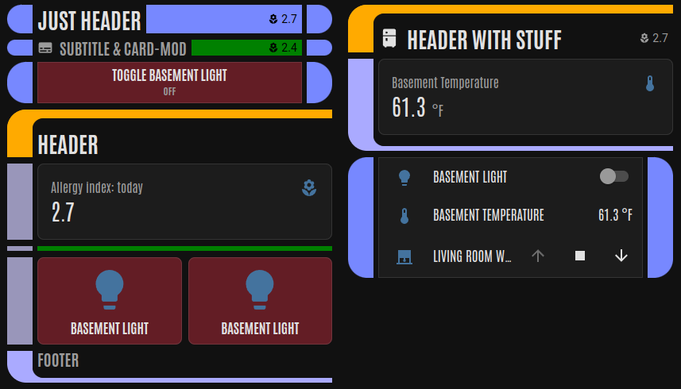

# LCARS-Lite

This is a **lightweight** Home Assistant theme featuring a vague Star Trek
TNG LCARS feel.

This theme tries to avoid major customizations of your dashboard to support
the styling, doing most of the work via theme-internal `card-mod` rules.



For a more full-featured theme, see [th3jesta/ha-lcars][th3jesta].
Thanks to [TheLCARS][thelcars] for styling notes.

[th3jesta]: https://github.com/th3jesta/ha-lcars
[thelcars]: https://www.thelcars.com

## Installation Instructions

The high-level steps to install are:

1. Install `card-mod`
2. Configure and install frontend theme.
3. Install resources.

### Install `card-mod`

Install `card-mod` using HACS or per the instructions on the [card-mod GitHub page][cardmod].

[cardmod]: https://github.com/thomasloven/lovelace-card-mod

### Install frontend theme

Follow the Home Assistant instructions on the [frontend page][frontend] to
enable themes.

Install the theme by downloading the latest release and extracting it into
your `themes` folder. Alternatively, `git clone` into your `themes` directory.

Note, this theme is _not_ installable via HACS (because of HACS file
limitations).

For example, your `configuration.yaml`:

```yaml
frontend:
  themes: !include_dir_merge_named themes
  extra_module_url:
  - /local/card-mod.js
```

With the corresponding folder layout:

```
themes/
    lcars-lite/
        lcars_masonry.yaml
        lcars_sections.yaml
```

[frontend]: https://www.home-assistant.io/integrations/frontend/

### Install resources

This theme requires the `Antonio` font.

Add the font to your Lovelace resources by navigating to:

> `Settings` > `Dashboards` > 3-dot menu > `Resources`

From there, add the following resource:

```
https://fonts.googleapis.com/css2?family=Antonio:wght@400;700&display=swap 
```

## Using the theme

There are variants of the theme, to be used by the dashboard
view type:

* LCARS-Lite (Masonry) -- `lcars_masonry.yaml`
* LCARS-Lite (Sections) -- `lcars_sections.yaml`

To customize colors, edit the theme colors at the top of the
`yaml` file(s).

For example usage in a dashboard, see the `examples` folder.

### Sections View Notes

To build a *LCARS Panel*, make sure all cards within a Section are
tagged as "full width". Otherwise the Section will be treated as
a *LCARS Row*.

Within a *LCARS Panel*, use a "Grid" Card to support horizontal or
vertical grouping of multiple cards.

### Masonry View Notes

Use a "Vertical Stack" Card to group multiple cards together into
a single *LCARS Panel*.

Within a *LCARS Panel*, use a "Grid" Card to support horizontal or
vertical grouping of multiple cards.

## Customizing Cards

Some UI things require `card-mod` rules on the cards themself.

### Card-Specific Bar Background

### Card-Specific Button Color
